<h1>Database Query Challenge</h1>
<h6>Company to be left unnamed</h6>

<b>Data columns:</b>
<ul>
  <li>order_id - the unique id of an order.</li>
<li>customer_id - the unique id of the customer that placed the order.</li>
<li>created_at - the time the order was created.</li>
<li>updated_at - the time the order was updated.</li>
<li>closed_at - the time the order was closed.</li>
<li>processed_at - the time the order was processed.</li>
<li>status - the status of the order.</li>
<li>number - an internal identifier for the order.</li>
<li>total_price - the total price the customer paid, including tax.</li>
<li>total_tax - the total tax the customer paid.</li>
<li>payment_status - the payment status of the order.</li>
  </ul>
  
<b>Tasks:</b>
<ol>
<li>We need basic insights into hourly sales performance. We'd like a query that shows the following metrics by hour: 
revenue (total_price less total_tax) 
total number of orders 
number of orders placed by a customer who has previously placed an order</li>
<li>Upon further inspection, it has been noticed that there are a number of hours for which there are no orders. It's not clear why, so we'd like a query that lists all hours for which there are no orders.</li>
<li>Your query from #1 may not have accounted for hours for which there are no orders. Copy your query from #1 and ammend the query to show "0" for all metrics when there is no data for a given hour.</li>
<li>We'd like to know the difference in revenue from customers who have completed one order versus customers who have completed more than one order. Write a query that shows the total revenue (total_price less total_tax) for each of these two groups: New Customers and Returning Customers.</li>
<li>We'd like a rudimentary estimate of when a customer might place another order and the next order's value, based on the time between their last two orders. For all customers that have completed more than one order, write a query that shows the customer_id, last_order_date and next_projected_order_date, and next_projected_order_value where next_projected_order_date is their last order plus the amount of time between their last two orders and next_projected_order_value is the average of their last two orders' total_price less total_tax.</li>
<li>You might find that some customers have orders that are only seconds apart from each other. This seems like bad data. Copy the query from #5 and ammend to filter out any customers whose orders are less than a minute from each other.</li>
  </ol>
  
<h3>Preview of Dataframe</h3>

  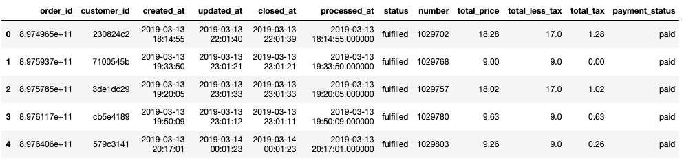 

 
 

  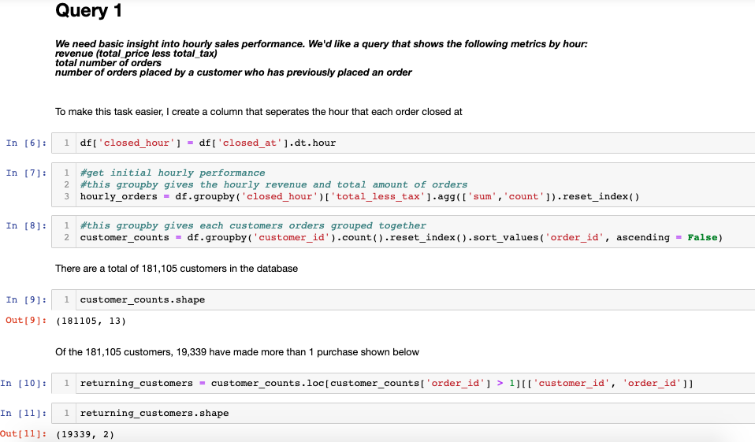 

 

  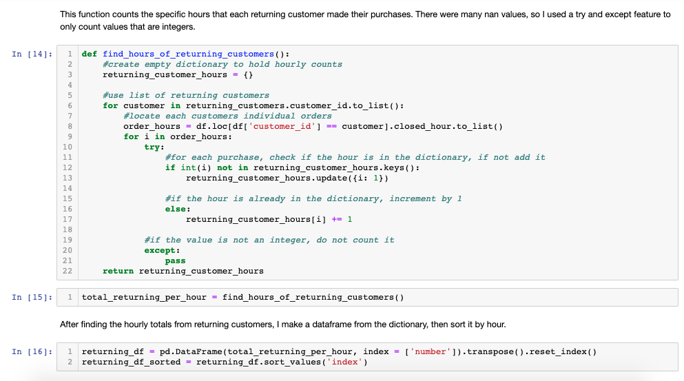 

 

  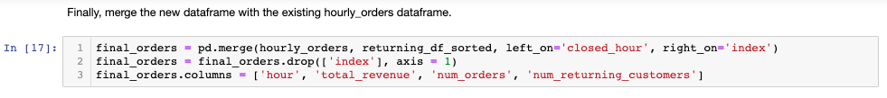 

 

  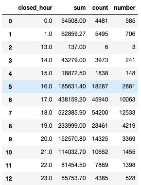 

 
 

  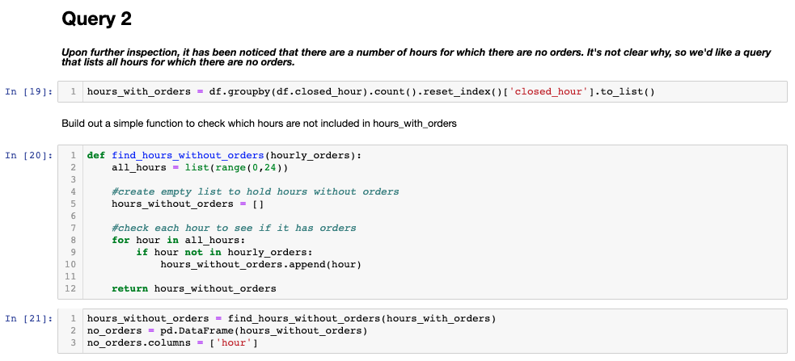 

 

  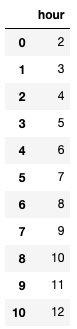 

 
 

   

 

  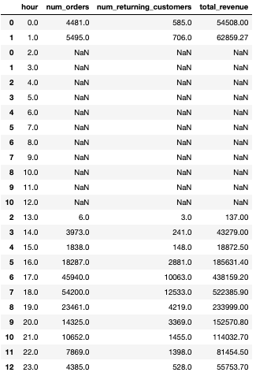 

 
 

  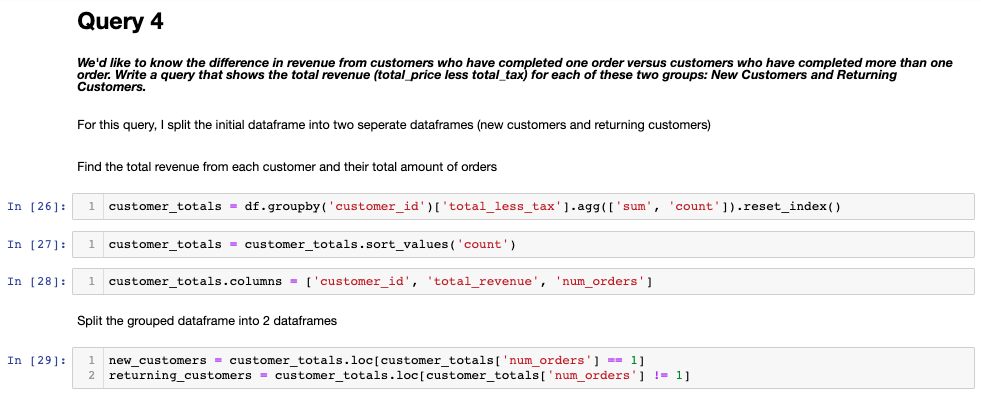 

 

  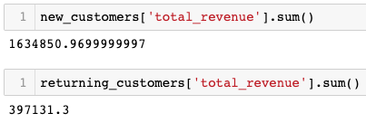 

 
 

   

 

  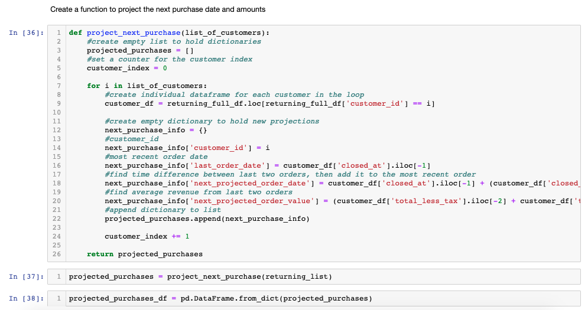 

 

  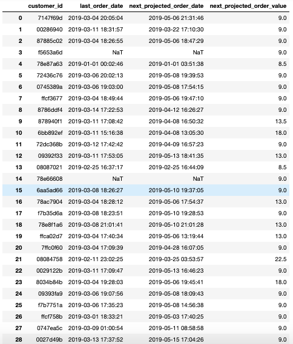 

 
 

  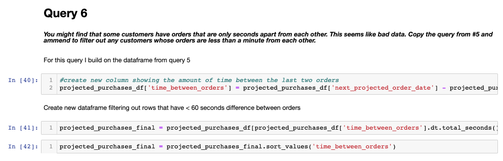 

 

  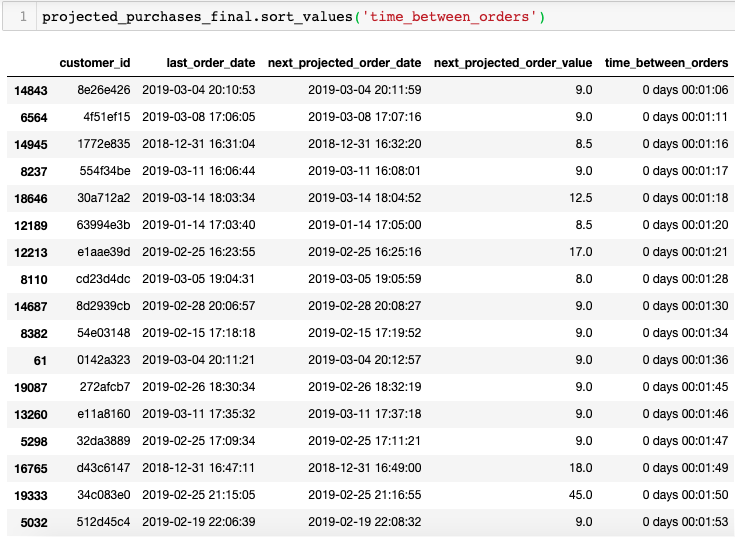 

 
 
 
